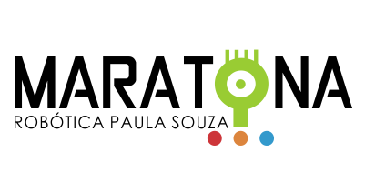

<h1 align="center">MARATONA-PROGRAMACAO-CPS</h1>

<p align="center">
  
</p>

#
### CLASSIFICAÇÃO

- Medalha de Ouro / 1° Lugar.

#
### SOBRE

- Diretório contendo as soluções desenvolvidas em Java, submetidas durante a 10° Maratona de Programação, promovido pelo Centro Paula Souza.

#
### INFORMACOES

- *Escola*: 199 - Etec Cidade Tiradentes
- *Orientador*: Danadoni Lima dos Santos
- *Equipe*: Adestradores de Samurai
- *Curso*: METC-Desenvolvimentos de Sistemas
- *Integrantes*: Kaique Souza Santos, Wiliam Melo da Mota e Paulo

#
### TECNOLOGIA

&nbsp;

#
### CONTRIBUIÇÃO

```
$ git clone https://github.com/kaiquesouzasantos/java-maratona-programacao-cps.git 
```
